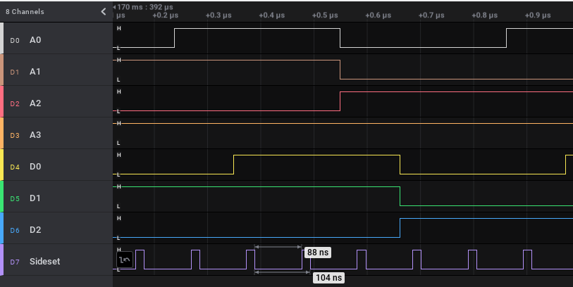
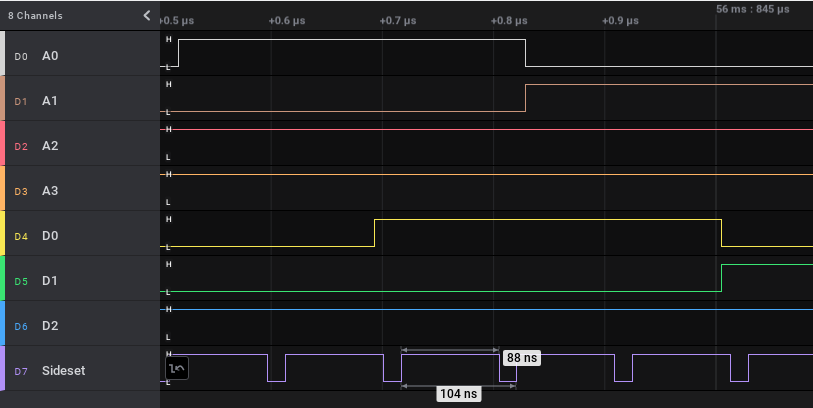

# picoROM_pio
As mentioned in the main [README](../README.md), this project was based on the idea of [picoROM](https://github.com/nickbild/picoROM) used in his homebrew 6502-based computer running at 2MHz.  The picoROM project overclocks the Pico massively from 125MHz to 400MHz, which then means that the Flash chip cannot keep up so more work is necessary to run everything from RAM.

On first reading, one gets the impression that the overclocking was necessary to meet the performance requirements although that's not actually stated explicitly (but why overclock if it's not necessary?).  That was my starting point for picoROM_pio: can the same thing be achieved without overclocking (or not as much)?

Because I have no real need for the project, I didn't stop to actually measure the performance of the original code until I was [prompted](https://github.com/rhulme/picoROM_pio/issues/2).

***
***TL;DR: The original code is slightly faster than the PIO/DMA implementation***
***

Before we start, all the tests here have been performed running the Pico at the standard 125MHz.  That means one cycle takes 8ns (1/125000000).  I modified both the C and the PIO code slightly to toggle an additional pin to allow measurements to be made.  The modified source code can be found in [perf_test](perf_test).

# C code
The heart of the C implementation is a tight loop:
```c
    ...
    // Continually check address lines and
    // put associated data on bus.
    while (true) {
        put_data_on_bus(get_requested_address());
    }
}

int get_requested_address() {
    // Return only first 15 bits.
    return gpio_get_all() & 32767;
}

void put_data_on_bus(int address) {
    // int data = rom_contents[address];

    // gpio mask = 8355840; // i.e.: 11111111000000000000000
    // Shift data 15 bits to put it in correct position to match data pin defintion.
    gpio_put_masked(8355840, rom_contents[address] << 15);
}
```
The function calls are inlined by the compiler and everything boils down to 9 instructions, which take a total of 11 cycles to execute

```
100004e8:    684a      ldr     r2, [r1, #4]
100004ea:    6908      ldr     r0, [r1, #16]
100004ec:    4032      ands    r2, r6
100004ee:    5ca3      ldrb    r3, [r4, r2]
100004f0:    011b      lsls    r3, r3, #4
100004f2:    4043      eors    r3, r0
100004f4:    402b      ands    r3, r5
100004f6:    61cb      str     r3, [r1, #28]
100004f8:    e7f6      b.n     100004e8 <main+0x2c>
```

11 cycles means one loop completes in 88ns.

To check this, the modified code sets a pin high just before reading the address bus and low just before getting the data and putting on the data bus:
```c
int get_requested_address() {
    // Return only first 4 bits.
    gpio_put(TIMING_PIN, true);

    return gpio_get_all() & 0x0F;
}

void put_data_on_bus(int address) {
    gpio_put(TIMING_PIN, false);
    // int data = rom_contents[address];

    // gpio mask = 8355840; // i.e.: 11111111000000000000000
    // Shift data 15 bits to put it in correct position to match data pin defintion.
    gpio_put_masked(0xF0, eeprom_data[address] << 4);
}
```

The two new instructions add another two cycles to the total loop time so we now expect a total of 13 cycles or 104ns

```
10000510:   6150        str     r0, [r2, #20]   ; gpio_put(TIMING_PIN, true);
10000512:   6851        ldr     r1, [r2, #4]
10000514:   6190        str     r0, [r2, #24]   ; gpio_put(TIMING_PIN, false);
10000516:   4039        ands    r1, r7
10000518:   5c63        ldrb    r3, [r4, r1]
1000051a:   6915        ldr     r5, [r2, #16]
1000051c:   011b        lsls    r3, r3, #4
1000051e:   406b        eors    r3, r5
10000520:   4033        ands    r3, r6
10000522:   61d3        str     r3, [r2, #28]
10000524:   e7f4        b.n     10000510 <main+0x28>
```

The timing confirms it (D3 is not shown as I only have eight inputs on the logic analyser!):


So a normal loop without instrumentation code takes 88ns.

# PIO/DMA
The PIO code is only three instructions, each one theoretically taking one cycle but the final instruction will stall whilst it waits for the DMA transfers to fetch and return the data value to complete.

The same measurement was done for the PIO code but here the sideset feature was used, which allow the pin to be toggled without affecting the timing.  In this case, the pin was pulled low when reading the address bus and high when waiting for the data.

```
; Shift the address bus into the ISR
in pins, addr_bus_width side 0

; Shift in the top-most address bits of the array holding the EEPROM data
; This will cause auto-push to push the ISR to our RX FIFO
in x, (32 - addr_bus_width)

; Auto-pull the data from the TX FIFO and put it on the data bus
out pins, data_bus_width side 1
```

The measurements show that one loop takes 104ns and the final PIO instruction takes a total of 11 cycles (88ns) to complete:



As the sideset feature does not affect the timing, the PIO/DMA implementation is actually 2 cycles slower than the pure C code.

The `out` instruction itself will take 1 cycle, so that means it's stalling for 10 cycles.  As it's hard to see exactly where this time is being spent, I [asked](https://github.com/raspberrypi/pico-feedback/issues/202).  Each DMA transfer takes 4 cycles and we have two separate transfers, so that's 8 cycles.  I'm still not exactly sure what the other two cycles are used for but presumably something like data moving through the FIFOs.  Whatever it is, it doesn't look like it is something that could be optimised.

# Conclusion
The original C code is already about as fast as it can be although it might even be possible to shave off another two cycles.  The `eors` at the end appears to be unnecessary given the `ands` following it, which means the correspond `ldr` would also be unnecessary - but I haven't tried it.

I don't think the PIO/DMA implementation can be optimised any further (though I'm happy to be proved wrong), and is held back by the need to start two separate single-word DMA transfers.

With a loop time (or 'access time' in the context of a dedicated memory chip) of 88ns and nothing to synchronise the lookup with an address being placed on the bus, any system using this should keep the address bus stable for more than 166ns before reading the data bus to be sure of always getting the right value.  Where the original project talks about 4MHz access, if that corresponds to 1/4000000, or a new address every 250ns, the Pico should easily handle that without overclocking.

Obviously the C code cannot be altered to do anything else without increasing the access times.  That includes anything that causes interrupts to be serviced, but if additional functionality is required in any way, the loop could be placed on the second core leaving the first core free to do other things.

It's not clear why the original project overclocked the Pico so drastically unless it was perhaps to provide similar performance to the FPGA-based [RapidRom](https://github.com/nickbild/fpga_rom_emulator) project.

Even if the PIO/DMA approach is not quite as efficient as the pure C implementation in this case, I still think it's an interesting idea and has proved its worth in terms of education!
